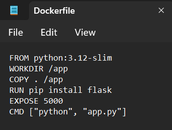

# 🚀 Flask App Deployment on AWS ECS using Fargate

---

## 📌 Project Overview
**Containerized** a Python Flask application using **Docker** and deployed it on **AWS ECS** with **Fargate** (serverless compute), demonstrating:
- **Containerization** best practices
- **CI/CD** pipeline fundamentals
- **Cloud Infrastructure** management
- **IaC** (Infrastructure as Code) concepts

---
## 📂 Project Structure
```bash
flask-ecs-project/
├── app/                     # Flask application
│    └──app.py               # Main application logic   
├── infrastructure/
│   └─ task-definition.json  # ECS task definition
├── screenshots/             # Deployment documentation
├── Dockerfile               # Container configuration
├── .dockerignore            # Files excluded from Docker build
└── README.md                # Project documentation
```
---
## 📸 Step-by-Step Visual Walkthrough

### 1. Local Flask Application

  
*Code for a simple Flask Application*

---

  
*Code for Dockerfile in the project root*

---

  
*Flask app running locally at `localhost:5000`*

---

### 2. Docker Build Process

  
*Built Docker image with successful output*

---

### 3. AWS ECR Repository


  
*Created an Elastic Container Registry Repository*

---

  
*Pushed the docker image to Elastic Container Registry*

---

  
*Container image stored in Elastic Container Registry*

---

### 4. ECS Cluster Configuration
  
*Created an ECS cluster*

---

  
*ECS cluster dashboard showing running service*

---

### 5. Task Definition Setup
  
*Fargate task configuration in AWS console*

---

### 6. Security Group Rules
  
*Port 5000 open in inbound rules*

---

### 7. Running Service Details
  
*Service details showing healthy tasks*

---

### 8. Production Deployment
  
*Final app accessible via public IP*

---

## 🛠️ Technologies Used
**Cloud Services**  

- ECS (Elastic Container Service)
- Fargate (Serverless Compute)
- ECR (Container Registry)
- EC2 (Networking & Security)
- IAM (Access Management)
- VPC (Networking)

**Tools**  


---

## 📂 Project Setup

### Prerequisites
- AWS Account (Free Tier)
- AWS CLI configured (`aws configure`)
- Docker installed
- Python 3.9+

### Installation
---
# Clone repository
```bash
git clone https://github.com/git-hub-user7/ Flask-ECS-Deployment.git
cd  Flask-ECS-Deployment
```

# Install dependencies
```bash
pip install -r requirements.txt
```

# Build Docker image
```bash
docker build -t my-app .
```
# Run locally
```bash
docker run -p 5000:5000 my-app
```
---
### ☁️ AWS Deployment Steps

## 📦 Step-1: Create ECR Repository

```bash
aws ecr create-repository --repository-name my-app
```
---
## 📤 Step-2: Push Docker Image to ECR

```bash
aws ecr get-login-password | docker login --username AWS --password-stdin <ACCOUNT_ID>.dkr.ecr.<REGION>.amazonaws.com

docker tag my-app:latest <ACCOUNT_ID>.dkr.ecr.<REGION>.amazonaws.com/my-flask-app:latest

docker push <ACCOUNT_ID>.dkr.ecr.<REGION>.amazonaws.com/my-app:latest
```
---
## 🔑 Step-3: Create an IAM Role for ECS Execution

To allow ECS to pull the image from ECR and execute tasks, create an IAM Role with permissions.

1️⃣ Create a Role for ECS:

```bash
aws iam create-role \
  --role-name ecsTaskExecutionRole \
  --assume-role-policy-document file://<(echo '{
    "Version": "2012-10-17",
    "Statement": [
      {
        "Effect": "Allow",
        "Principal": { "Service": "ecs-tasks.amazonaws.com" },
        "Action": "sts:AssumeRole"
      }
    ]
  }')
```
---
2️⃣ Attach Required Policies:

```bash 
aws iam attach-role-policy \
  --role-name ecsTaskExecutionRole \
  --policy-arn arn:aws:iam::aws:policy/service-role/AmazonECSTaskExecutionRolePolicy
```
---
## 🚀 Step-4: Create ECS Cluster

```bash
aws ecs create-cluster --cluster-name my-app-cluster
```
---
## 📜 Step-5: Define an ECS Task:

Modify and save this task-definition.json file:

```json
{
    "family": "my-app-task",
    "networkMode": "awsvpc",
    "executionRoleArn": "arn:aws:iam::381492283896:role/ecsTaskExecutionRole",
    "containerDefinitions": [
        {
            "name": "my-app-container",
            "image": "381492283896.dkr.ecr.us-east-1.amazonaws.com/my-app:latest",
            "memory": 512,
            "cpu": 256,
            "essential": true,
            "portMappings": [
                {
                    "containerPort": 5000,
                    "hostPort": 5000,
                    "protocol": "tcp"
                }
            ]
        }
    ],
    "requiresCompatibilities": ["FARGATE"],
    "cpu": "256",
    "memory": "512"
}

```
Register the task:

```bash
aws ecs register-task-definition --cli-input-json file://task-definition.json  
```
---
## 🔄 Step-6: Configure Networking (VPC & Security Groups)

Find your default VPC and subnet:

```bash
aws ec2 describe-vpcs --query "Vpcs[?IsDefault].VpcId" --output text
aws ec2 describe-subnets --query "Subnets[*].SubnetId"
```
Find your security group and allow port 5000:

```bash
aws ec2 describe-security-groups --query "SecurityGroups[*].GroupId"
aws ec2 authorize-security-group-ingress --group-id <SECURITY_GROUP_ID> --protocol tcp --port 5000 --cidr 0.0.0.0/0
```
---
## 📌 Step-7: Create an ECS Service

```bash
aws ecs create-service --cluster my-app-cluster --service-name my-flask-service --task-definition my-flask-app-task --desired-count 1 --launch-type FARGATE --network-configuration "awsvpcConfiguration={subnets=[<SUBNET_ID>],securityGroups=[<SECURITY_GROUP_ID>],assignPublicIp='ENABLED'}"

```
---
## 🌐 Step-8: Get Public IP of the Running Task

Find the Task ARN:
```bash
aws ecs list-tasks --cluster my-app-cluster --query "taskArns[0]" --output text
```
---
Find the Network Interface ID (ENI):

```bash
aws ecs describe-tasks --cluster my-app-cluster --tasks <TASK_ARN> --query "tasks[*].attachments[*].details[?name=='networkInterfaceId'].value"
```
---
Find the Public IP:
```bash
aws ec2 describe-network-interfaces --network-interface-ids <ENI_ID> --query "NetworkInterfaces[*].Association.PublicIp" --output text
``` 
---

📚 Learning Outcomes
---
**✅ Containerized applications using Docker**

**✅ Implemented cloud infrastructure on AWS**

**✅ Configured IAM roles and security policies**

**✅ Managed container orchestration with ECS**

**✅ Practiced infrastructure-as-code principles**

🤝 Connect with Me
Let's discuss cloud technologies and career opportunities!

📧 Email: dhwarakesh99@gmail.com
💼 LinkedIn: Dhwarakesh Srinivasan
📂 GitHub: git-hub-user7
